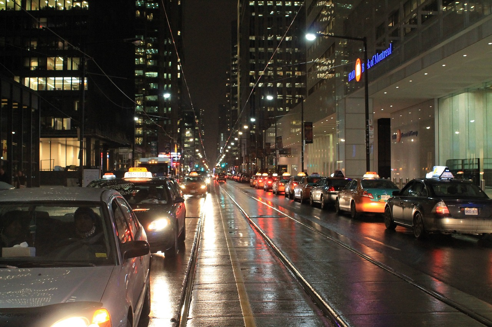

# FI - Transports

Ce projet a été développé dans le cadre du cours "Fiction Interactive", dispensé par Isaac Pante (SLI, Lettres, UNIL).

Travail réalisé par Clara Montoya Silva et André da Glória Santiago.

# Jouer au jeu
Le jeu est sur la plateforme [itch.io](https://dresovense.itch.io/fiction-interactive-transports).
Autrement, il suffit de télécharger le fichier .html, puis de le lancer sur le navigateur.

# Histoire
Le joueur incarne un étudiant dans une université nord-américaine. Il devra faire plusieurs choix concernant ses modes de déplacement ou
bien sa vie personelle. Alors que l'examen de fin de semaine approche, arriverez-vous à travailler assez pour le passer, sans toutefois
négliger votre vie sociale?

# Le concept
Cette fiction interactive cherche à questionner le lien entre la planification urbaine en villes tentaculaires à faible densité, et les
problèmes qu'une telle vision peut engendrer dans la mobilité des personnes, la création de réseaux de transports publics et l'efficacité
de ces derniers ou encore sur la possibilité de se passer de voiture sans que cela impacte notre santé mentale et vie sociale.

Ainsi, le concept central de la fiction se trouve derrière la durée d'attente devant les choix de déplacement. Afin que le joueur fasse
l'expérience du choix qu'une personne habitant dans les banlieues de ces villes possède, il doit attendre un nombre de secondes équivalant
à la durée du trajet (1 seconde = 5 minutes de trajet). Le but étant ainsi de montrer la frustration qu'une personne peut avoir dès qu'elle
décide (ou même n'a plus le choix) de se déplacer en transports publics, et de la perte de temps utile qu'engendre de tels choix.

Quelques articles pour approfondir ces thèmes:

- https://www.resilience.org/stories/2021-06-14/urban-walkability-gains-a-foothold-in-the-u-s/
- https://smartgrowthamerica.org/wp-content/uploads/2016/08/measuring-sprawl-2014.pdf

L'image utilisée précédemment est disponible (gratuitement) sur le site suivant:
https://pixabay.com/fr/